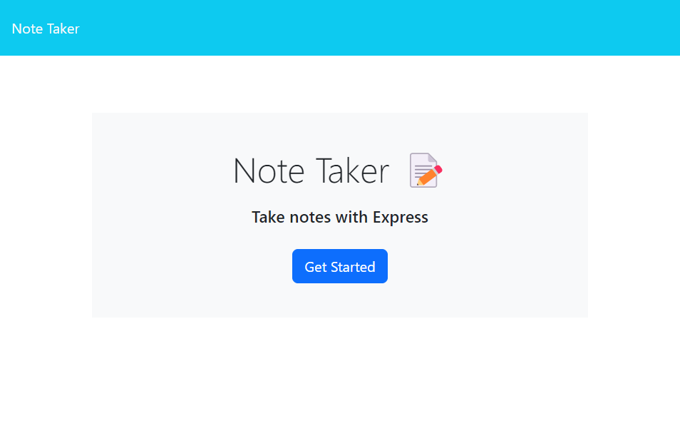

# Note-Taker-Challenge-11

## Description
With the goal of being able to have an application to write and save notes, I created a simple Note Taker. Upon opening, the user is presented with a landing page with a link to a nots page. After clicking to get to the notes page, the user is present with existing notes listed in a column on the left had side and an empty field on the right the enter a note’s title and text. After entering the text, a save button is presenting the upper right corner. After clicking save, the new note appears in the left-hand column with the existing notes. When the use clicks a note from the left-hand column, that note appears in the right with the text details present. When the use clicks the + icon in the upper right, the title and text fields clear and are ready for a new note. 

## Table of Contents
1. [Installation](#installation)
2. [Usage](#usage)
3. [Credits](#credits)
4. [Tests](#tests)
5. [Questions](#questions)
6. [License](#license)

## Installation
To install the necessary dependencies, run the following command:
    
    npm i

## Usage
https://github.com/ericolson1977/Note-Taker-Challenge-11

## Credits
Express version 4.16.4 was used. 

Front end code provided by the instructional staff.

## Tests
To run tests, run the following command:
    
    npm test

## Questions
If you have any questions about the repo, open an issue or contact me directly at mr_tues_night@yahoo.com. You can find more of my work at [ericolson1977](https://github.com/ericolson1977).

## License
  This project is licensed under the MIT license.
